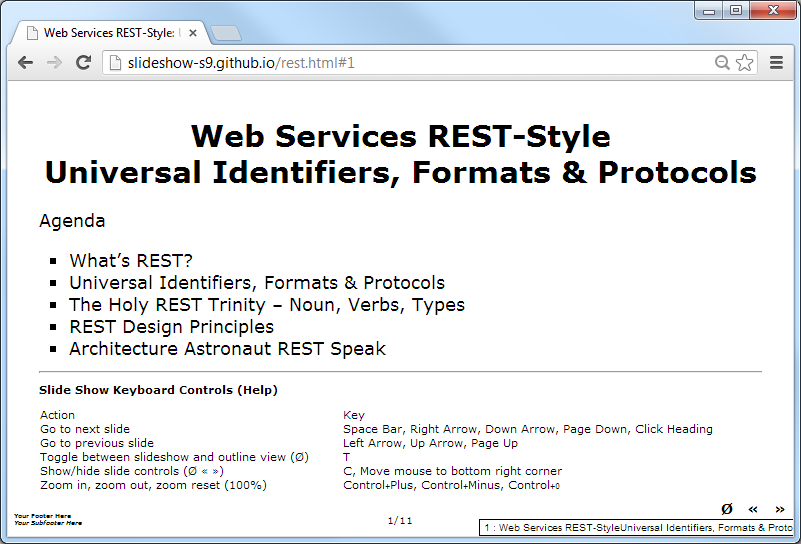

# {{ page.title }}

<div class="toc" markdown="1">
Contents:

* [What's Slide Show (S9)?](#whatis)
* [Getting Started in 1-2-3 Easy Steps](#steps)
* [What's Markdown?](#markup)
* [About, License - Questions? Comments?](#about)
</div>


## What's Slide Show (S9)?   {#whatis}

A free command line tool that lets you build slide shows
from your notes
written in plain text with markdown formatting conventions.
The Slide Show (S9) project also collects and welcomes themes
and ships "out-of-the-box" with built-in support
for "loss-free" gradient vector graphics backgrounds.


## Getting Started in 1-2-3 Easy Steps   {#steps}

* Step 1: Write your slides in plain text with markdown formatting conventions
* Step 2: Build your slide show using the `slideshow` command line tool
* Step 3: Open up your slide show (web page) in your browser and hit the space bar to flip through your slides
* That's it. Showtime!


### Step 0: Install the `slideshow` command line tool

Use the Ruby package manager, that is, `gem` to install:

```
$ gem install slideshow
```

### Step 1: Write your slides in plain text with markdown formatting conventions

Slide Show lets you write your slides in plain text with markdown formatting
conventions for headings, emphasis, links, images and more.
Let's write some slides about best practices for web services using REST:

```
# Web Services REST-Style: Universal Identifiers, Formats & Protocols

Agenda

- What's REST?
- Universal Identifiers, Formats & Protocols
- The Holy REST Trinity - Noun, Verbs, Types
- REST Design Principles 
- Architecture Astronaut REST Speak


# Representational State Transfer (REST) - Meaningless Acronym? Wordplay?

rest - n. - peace, ease, or refreshment resulting from the insight that the web works

No matter what vendors tell you - no need to "Light Up the Web" - relax - built on
an **open architecture using universal identifiers, formats & protocols and _evolving_
open standards** - no need to reinvent the wheel and sign-up for single-vendor offerings.

### Broad Definition

- Best Practices for Designing Web Services for a Unified Human and Programable Web

### Narrow Definition

- Alternative to BigCo Web Services (SOAP, WS-\*) and RPC-Style Web Services (XML-RPC)
```

Use headings `#` to start a new slide. That's it.
For more formatting options see the Markdown reference.


### Step 2: Build your slide show using the `slideshow` command line tool

Run `slideshow` to build your slide show. The `slideshow` command line tool
expects the name of your source document (e.g. `rest.text`)
and will build a web page
(e.g. [`rest.html`](demos/rest.html)
that is an all-in-one-page handout and a live slide show all at once.

```
$ slideshow build rest.text

=> Preparing slideshow 'rest.html'...
=> Done.
```

### Step 3: Open up your slide show in your browser

Open up your slide show [`rest.html`](demos/rest.html)
in your browser (Firefox, Chrome, Opera, Safari, Edge and others) and hit F11 to switch 
into full screen projection and hit the space bar or the right arrow, down arrow
or page down key to flip through your slides.

<a href="demos/rest.html"></a>

That's it. Voila.

### Bonus: Try some different templates/theme packs

* [S6 PDF Theme](demos/tutorial.pdf.html) -> [PDF](demos/tutorial.pdf)
* [Google HTML5 Slides Theme](demos/packs/g5/tutorial1.html5.html)
* [S5 Blank](demos/packs/s5/tutorial1.html)
* [Slidy W3C Blue Theme](demos/packs/slidy/tutorial1.w3c.html)
* [More »](gallery.html)


## What's Markdown?   {#markup}

Markdown is a "markup" language that lets you write
your notes in plain text with formatting conventions
that have been used in email and online since the beginning of the internet.

* [Learn Markdown in 60 Seconds](http://commonmark.org/help)
* [Learn Markdown in 10 Minutes](http://commonmark.org/help/tutorial) - interactive tutorial; lessons incl. emphasis, paragraphs, headings, links, images, blockquotes, lists and more.


## About, License   {#about}

Gerald Bauer and contributors designed and coded the `slideshow` machinery.
See the change log for contributions and credits.

License. The slide show scripts and templates are dedicated to the public domain.
Use it as you please with no restrictions whatsoever.



